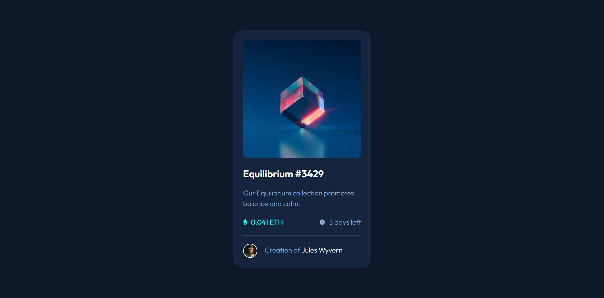

# Frontend Mentor - NFT preview card component solution

This is a solution to the [NFT preview card component challenge on Frontend Mentor](https://www.frontendmentor.io/challenges/nft-preview-card-component-SbdUL_w0U). Frontend Mentor challenges help you improve your coding skills by building realistic projects. 

## Table of contents

- [Overview](#overview)
  - [The challenge](#the-challenge)
  - [Screenshot](#screenshot)
  - [Links](#links)
- [My process](#my-process)
  - [Built with](#built-with)
- [Author](#author)

## Overview

### The challenge

Users should be able to:

- View the optimal layout depending on their device's screen size
- See hover states for interactive elements

### Screenshot

### Links

- Solution URL: [GitHub](https://github.com/sevvy-thewebcoder/nft-preview-card)
- Live Site URL: [NFT-Preview-Card](https://sevvy-thewebcoder.github.io/nft-preview-card/)

## My process

### Built with

- Semantic HTML5 markup
- CSS custom properties
- CSS Flex-box
- Mobile-first workflow

## Author

- LinkedIn - [@webcodersevvy](https://www.linkedin.com/in/webcodersevvy/)
- Instagram - [@webcodersevvy](https://www.instagram.com/webcodersevvy/)
- Frontend Mentor - [@sevvy-thewebcoder](https://www.frontendmentor.io/profile/sevvy-thewebcodersevvy/)
- Twitter - [@webcodersevvy](https://www.twitter.com/webcodersevvy/)
